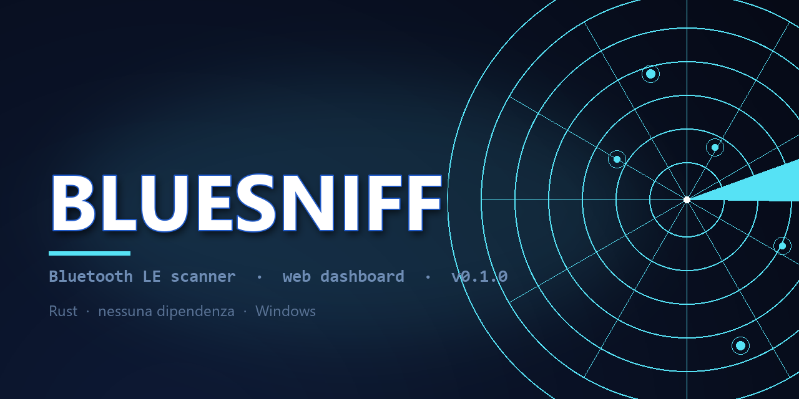
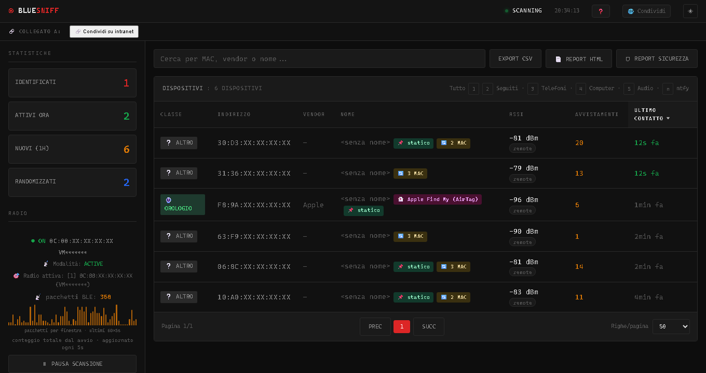

# bluesniff

<p align="center"></p>

**Monitor passivo/attivo dei dispositivi Bluetooth intorno al tuo PC.**

bluesniff ascolta gli annunci BLE e interroga i telefoni che conosci via
Bluetooth Classic, tenendo traccia di chi è vicino e quando. Include una
dashboard web locale con radar di prossimità, heatmap storiche, rilevamento
di tracker/spam BLE, e notifiche push quando un dispositivo che segui arriva
o se ne va.

Scritto in Rust, **Windows-only** (usa WinRT per l'accesso BLE nativo).

---

## Indice

> **[English summary](#english)** · [Dashboard](README-DASHBOARD.md) · [CHANGELOG](CHANGELOG.md)

- [Cosa fa](#cosa-fa)
- [Cosa NON fa](#cosa-non-fa)
- [Installazione](#installazione)
- [Uso rapido](#uso-rapido)
- [La dashboard](#la-dashboard)
- [Seguire un dispositivo (notifiche)](#seguire-un-dispositivo-notifiche)
- [Ignorare un dispositivo](#ignorare-un-dispositivo)
- [Il tuo dispositivo ("sono io")](#il-tuo-dispositivo-sono-io)
- [Report HTML (un file da condividere)](#report-html-un-file-da-condividere)
- [Comandi principali](#comandi-principali)
- [Controllare bluesniff da un altro processo](#controllare-bluesniff-da-un-altro-processo)
- [Binario pronto (Windows)](#binario-pronto-windows)
- [Diagnostica](#diagnostica)
- [File prodotti](#file-prodotti)
- [Privacy e sicurezza](#privacy-e-sicurezza)
- [Build da sorgente](#build-da-sorgente)
- [Licenza](#licenza)

---

## Cosa fa



*La dashboard mentre ascolta. Gli indirizzi MAC e il nome del computer sono
mascherati (`XX`, `VM******`): l'immagine è stata scattata con la modalità
screenshot attivata, quindi nessuno dei dati di chi l'ha fatta è leggibile.*

**Monitoraggio di presenza.** Ogni 10 secondi bluesniff apre la radio BLE per
8 secondi e registra ogni dispositivo unico visto. Ogni 60 secondi interroga
attivamente i telefoni che hai marcato come "noti" tramite Bluetooth Classic
(un *page* RFCOMM, non un pairing: funziona anche a schermo spento).

**Dashboard web locale.** Una pagina con:
- Tabella di tutti i dispositivi visti, ordinabile e filtrabile (per classe,
  RSSI, vendor, tracker, randomizzati, ecc.)
- Radar di prossimità animato
- Heatmap orarie/giornaliere per dispositivo (da `presenze.csv`)
- Scheda dettaglio con storico RSSI, stima distanza, sonde GATT/SDP
- Rilevamento CVE note (es. WhisperPair Fast Pair) e tracker BLE
  (AirTag, SmartTag, Tile, Chipolo, Find My Device...)

**Notifiche push.** Quando un dispositivo che segui arriva o parte, bluesniff
manda una notifica su [ntfy.sh](https://ntfy.sh) (gratuito, no account).

**Diagnostica radio.** Il comando `--inq` conta i pacchetti BLE ricevuti e
lancia un'inquiry Classic: distingue "non c'è nulla in onda" da "il tuo
dongle non riceve niente".

---

## Cosa NON fa

Per onestà, e perché cercare nel codice è peggio che leggerlo qui:

- **Non decodifica il contenuto dei pacchetti BLE.** Vede l'annuncio, non
  quello che viene scambiato dopo una connessione.
- **Non rompe l'anonimato dei MAC randomizzati.** Un MAC randomizzato viene
  registrato col suo fingerprint stabile (il payload dell'annuncio, che
  Apple/Samsung mantengono costante), ma non "risolviamo" il MAC reale.
- **Non fa geolocalizzazione.** Il radar mostra prossimità (distanza stimata
  dal RSSI), non direzione. L'angolo sul radar è solo una posizione stabile
  per non far sovrapporre i puntini.
- **Non funziona su Linux/macOS.** Tutto il codice che parla con le radio è
  Windows: il progetto non compila altrove, per scelta.
- **Non apre il firewall da solo.** La condivisione in rete richiede un
  comando esplicito con diritti di amministratore (vedi
  [Condivisione](#la-dashboard)).
- **Non si connette a dispositivi altrui senza consenso.** Le sonde GATT/SDP
  sono passive (lettura di servizi annunciati), non tentano pairing.

---

## Installazione

### Binario precompilato

Scarica `bluesniff.exe` dalla pagina delle release e mettilo in una cartella
a tua scelta. Non richiede installazione, né runtime .NET, né Visual C++
Redistributable.

Tutti i file di configurazione (`presenze.csv`, `bt_known.txt`, `names.txt`,
`ntfy.txt`, i log) vengono creati **accanto all'eseguibile**: mettilo in una
cartella in cui puoi scrivere.

### Da sorgente

Vedi [Build da sorgente](#build-da-sorgente).

### Requisiti

- **Windows 10 o 11** (build 19041 o superiore: serve WinRT Bluetooth LE)
- **Una radio Bluetooth** — integrata o un dongle USB. Su macchina virtuale
  serve il passthrough USB del dongle (vedi [Diagnostica](#diagnostica))
- **Nessun privilegio di amministratore** per l'uso normale. Serve admin solo
  se vuoi aprire la porta nel firewall per condividere la dashboard

---

## Binario pronto (Windows)

Nella cartella [`release/`](release) c'è l'eseguibile compilato, senza bisogno
di installare Rust:

| File | Cos'è |
|---|---|
| `bluesniff-0.1.0-windows-x64.exe` | Windows 10/11 a 64 bit |

Si scarica, si mette in una cartetta a scelta e si avvia con doppio clic
(oppure `bluesniff.exe --listen`). Tutti i file che produce — `presenze.csv`,
`bluesniff.log`, il report HTML — finiscono **accanto all'eseguibile**, non
nelle cartelle di sistema: basta copiare quella cartella per portarsi via
tutto, o cancellarla per non lasciare traccia.

> Firmato digitalmente? No. Windows SmartScreen mostra un avviso la prima
> volta, perché l'eseguibile non ha una firma con un certificato a nome tuo.
> È il prezzo di un progetto di una persona sola: si clicca «Altre
> informazioni» → «Esegui comunque», una volta sola.

Per rigenerarlo dopo un cambio, con `--remap-path-prefix` che sostituisce
il tuo nome utente nei messaggi di errore del binario:

```sh
# Unix
RUSTFLAGS="--remap-path-prefix=$HOME=bluesniff" cargo build --release

# Windows, per esteso
set RUSTFLAGS=--remap-path-prefix=C:\Users\<tuo-nome>=bluesniff
cargo build --release

cp target/release/bluesniff.exe release/bluesniff-<versione>-windows-x64.exe
```

Senza quella opzione il binario contiene il path assoluto della tua
cartella di lavoro (597 volte, in questo caso). Non è un segreto, ma è
inutile farlo viaggiare, e non costa niente rimuoverlo.

### Rigenerare l'immagine qui sopra

L'immagine è la dashboard vera, non un disegno. Per rifarla servono Chrome e
un'istanza di bluesniff in ascolto:

```sh
# la modalità screenshot maschera MAC, nomi e il nome del computer
chrome --headless=new --window-size=1600,1150 --screenshot=dashboard.png \
  "http://localhost:9000/?screenshot=1"
```

---

## Uso rapido

Cinque comandi coprono il 90% dei casi. `bluesniff --help` li elenca tutti,
divisi per sezione.

### 0. "Voglio solo guardare la dashboard"

```sh
bluesniff
```

Apre la dashboard su **http://localhost:9000** e resta in ascolto. È il
comando da usare se non hai mai scritto niente: non devi ricordare nessun
flag.

Se ti ferma un terminale a scatti, continua in background finché non prema
`q` (o Ctrl+C).

### 1. "Cosa c'è intorno a me, adesso?"

```sh
bluesniff --one-shot
```

Scansione BLE di 5 secondi, poi esce. Stampa i dispositivi trovati con nome,
vendor, RSSI e hint.

### 2. "Voglio monitorare nel tempo"

```sh
bluesniff --listen
```

Registrazione continua in `presenze.csv`. La **dashboard si apre da sola** se
c'è un terminale; per spegnerla: `--no-dashboard`.

L'accensione automatica vale solo se c'è un terminale e non si sta
trasmettendo dati a un altro programma. Con `--json` / `--push` resta spenta
(sono sottoprocessi di [netmonloc](https://github.com/tuo-utente/netmonloc):
aprire una porta lì sarebbe una scelta invisibile a chi ha lanciato il
comando), e anche senza terminale — cron, systemd, CI. Ogni 10 secondi la radio ascolta
per 8 secondi, ogni 60 secondi interroga i telefoni noti. I dati finiscono in
`presenze.csv` e sono visibili in tempo reale nella dashboard.

Premi `Ctrl+C` o digita `q` per uscire. Digita `stop` per mettere in pausa la
scansione senza chiudere il processo, `start` per riprendere.

> **Nota per chi usava bluesniff prima.** `bluesniff` senza argomenti faceva
> uno scan di 5 secondi. Ora avvia il monitor continuo con la dashboard. Lo
> scan è `--one-shot`. Se vedi comparire un avviso che te lo dice, è solo la
> prima volta.

### 3. "La radio è muta"

```sh
bluesniff --inq
```

Diagnostica della radio: quante radio vede, quanti pacchetti BLE riceve in 5
secondi, e un'inquiry Classic. Vedi [Diagnostica](#diagnostica).

---

## La dashboard

La dashboard si apre automaticamente con `--listen --dashboard`. Di default
ascolta solo su `127.0.0.1:9000` (raggiungibile solo dal tuo PC).

### Cosa vedi

**Pulsante ❓** (in alto a destra) — apre la legenda che spiega cosa
significano i termini usati nella pagina. Si apre da sola alla prima visita.

**Pulsante ❓** (in alto a destra) — apre la legenda che spiega cosa
significano i termini usati nella pagina. Si apre da sola alla prima visita.

**Sidebar sinistra** — statistiche (identificati, attivi, nuovi, randomizzati),
stato radio con grafico pacchetti, inquiry classic, ultimi eventi del monitor
`--inq`, radar di prossimità, filtri.

**Tabella centrale** — tutti i dispositivi visti. Clicca un'intestazione per
ordinare, clicca una riga per aprire la scheda dettaglio.

**Scheda dettaglio** — nome, MAC, vendor, RSSI storico, heatmap da
`presenze.csv`, pulsante **⭐ Segui**, pulsanti Sonda GATT / Sonda SDP.

### Come leggere le icone

| Icona | Significato |
|---|---|
| ⭐ | Dispositivo seguito (in `bt_known.txt`): ricevi notifiche |
| 👤 | Persona associata al dispositivo seguito (colonna 3 di `bt_known.txt`). Nella scheda, un `👤` accanto al nome del dispositivo è invece il badge "sono io" |
| 🔇 | Dispositivo ignorato (in `ignore.txt`): nascosto dai filtri, notifiche invariate |
| 👻 | Annuncio "phantom": Apple Continuity, Swift Pair, Samsung EasySetup. Non è una condanna: è un tipo di annuncio usato anche per spoof/spam |
| ⚠ + CVE | Il dispositivo matcha una vulnerabilità nota (es. WhisperPair Fast Pair) |
| 📌 statico | RSSI quasi immobile (varianza < 4 su ≥ 5 campioni): probabilmente un dispositivo fisso, non un segnale utile |
| 🔄 N MAC | N MAC condividono lo stesso fingerprint: un solo dispositivo fisico che cambia indirizzo (es. AirTag, telefono randomizzato) |

### Filtri rapidi

Dalla sidebar: Tutti, Attivi, Identificati, Sconosciuti, Randomizzati,
**Seguiti**, **Ignorati**, Con rischi, Tracker, Statici, Rotanti, e le classi
(Telefoni, Computer, Audio, Orologi, IoT, Veicoli, Phantom).

Se non hai ancora seguito nessun dispositivo, il filtro **Seguiti** mostra un
riquadro che spiega come accenderlo.

I dispositivi ignorati sono visibili **solo** nel filtro **Ignorati** (e nei
loro contatori sono contati a parte: `total` non li include). Sotto i filtri
c'è **Gestisci ignorati**, che apre l'elenco e permette di rimuoverli uno a uno
o in blocco — utile dopo qualche settimana, quando la lista è piena di cose che
non ricordi più di aver ignorato.

### Scorciatoie da tastiera

| Tasto | Azione |
|---|---|
| `/` | Cerca |
| `h` | Legenda: cosa significa tutto questo |
| `r` | Aggiorna |
| `c` | Vista compatta |
| `n` | Notifiche ntfy |
| `1`…`5` | Filtri rapidi (Tutti, Seguiti, Telefoni, Computer, Audio) |
| `?` | Mostra tutte le scorciatoie |
| `Esc` | Chiudi modali |

### Condivisione

Il pulsante **🌐 Condividi** in alto a destra espone la dashboard sulla rete
locale (`0.0.0.0:9000`). Il primo click chiede di aprire la porta nel firewall:
su Windows serve un comando esplicito con diritti di amministratore, che la
dashboard mostra già pronto da copiare.

**Non apriamo il firewall da soli**: è una decisione di sicurezza che spetta a
te, e va presa con gli occhi aperti. Se non hai i privilegi, la dashboard
condivide comunque il bind ma la porta resta filtrata: per questo motivo
compare una **striscia arancione in cima alla pagina** finché il problema
esiste. Non è un dettaglio della modale che puoi chiudere senza leggerlo,
proprio perché il sintomo che senti ("non riesco a collegarmi dal telefono")
è diverso da quello mostrato nella modale.

La riapertura del server richiede ~700 ms: il bind non è modificabile a caldo,
quindi la pagina si ricarica da sola.

Una volta attivata, la scelta viene ricordata in `share.json` e riapplicata
al prossimo avvio. Il servizio viene anche annunciato via mDNS
(`_blusniff._tcp.local.`), così chi è sulla stessa rete lo trova da solo.

> La condivisione sovrascrive `--dashboard-addr`: accesa, il bind è su
> `0.0.0.0`; spenta, torna a `127.0.0.1`.

### Usare la dashboard dal telefono

Sotto i 700 px di larghezza la dashboard cambia faccia da sola: la tabella a
sette colonne diventa una lista di card (una per dispositivo, con nome, MAC,
vendor, RSSI e ultimo contatto in pila) e i filtri, che stanno nella sidebar
nascosta, ricompaiono come chip scorrevoli in cima alla lista. Non c'è
niente da attivare: è la stessa pagina, non una versione "mobile".

Per aprirla dal telefono:

1. Sul PC, clicca **🌐 Condividi** (o lancia `bluesniff --dashboard-addr lan`)
2. Leggi l'indirizzo nella barra dei link condivisi, es. `http://192.168.1.20:9000`
3. Sul telefono aprilo nel browser

**Per installarla come app** (si apre a schermo intero, senza barra degli
indirizzi):

- **iPhone (Safari)**: tap Condividi → "Aggiungi alla schermata Home"
- **Android (Chrome)**: menu (⋮) → "Aggiungi a schermata Home"

Una nota onesta: i browser moderni non mostrano il prompt automatico di
installazione su un indirizzo in chiaro come `http://192.168.1.20:9000` — lo
chiedono solo su HTTPS. L'installazione manuale funziona lo stesso, e su iOS
è il modo normale. Per l'installazione automatica servirebbe un certificato
HTTPS, che è una cosa ben diversa da un pulsante.

Radar e heatmap si adattano: sul telefono le etichette accanto ai puntini del
radar spariscono (a 3 px di altezza non si leggono) e i puntini diventano più
grandi, perché il dito è molto meno preciso del mouse. Il resto — inclusi i
dettagli di ciascun dispositivo — si tocca normalmente.

---

## Seguire un dispositivo (notifiche)

Per ricevere una notifica quando un dispositivo arriva o se ne va, devi
seguirlo: aggiungerlo a `bt_known.txt` accanto all'eseguibile.

Ci sono due modi.

### Modo A — dalla dashboard (consigliato)

1. Clicca il dispositivo nella tabella
2. Nella scheda, clicca **⭐ Segui**

Fatto. Il MAC finisce in `bt_known.txt` e vale **subito**, senza riavviare
`--listen`: il loop di ascolto rilegge il file entro 30 secondi. Per toglierlo,
**✖ Smetti di seguire**.

L'editing è **preservante**: il pulsante aggiunge in fondo e rimuove una riga
sola. Commenti, righe vuote, ordine e le persone già assegnate agli altri
dispositivi non vengono mai riscritti.

### Modo B — a mano

Apri `bt_known.txt` (o lancialo con `bluesniff --edit-known`) e aggiungi una
riga:

```text
BTMAC;Nome;Persona
EC:ED:73:65:AC:45;Moto G73;Mario
```

- **`BTMAC`** — l'indirizzo Classic del telefono (12 cifre hex, con o senza
  separatori). **Non è il MAC BLE**: devi prendere quello Classic (lo vedi in
  `bt_known.txt` dopo il primo bootstrap, o con `bluesniff --learn`)
- **`Nome`** — etichetta breve, mostrata nel log, nelle notifiche e nella
  dashboard
- **`Persona`** — di chi è il dispositivo. Compare come badge 👤 nella scheda.
  Non finisce nelle notifiche, che usano il `Nome`

Le righe che iniziano con `#` sono commenti, ignorate.

### ⚠ I MAC BLE randomizzati non producono notifiche

Un segnale che la dashboard ti mostra spesso: **⚠ MAC randomizzato** sotto il
pulsante Segui. Non è un avviso sul dispositivo, è sul *come* lo stai seguendo.

`bt_known.txt` vuole un indirizzo **Classic** (BR/EDR), perché il probe usa
RFCOMM/AF_BTH. Quello che la dashboard vede è quasi sempre **BLE**, e i BLE
moderni ruotano l'indirizzo ogni ~15 minuti per privacy. Su un MAC randomizzato
il follow si salva, la stella compare e **non arriverà mai nessuna notifica**:
non è un guasto, è che stai dando a un indirizzo che cambia il compito di
un indirizzo che non cambia.

Non proviamo a convertire BLE → Classic: l'indirizzo vero non è in nessun
annuncio, non c'è modo di indovinarlo, e farlo significherebbe inventare un
dato. Se è il tuo telefono, il suo MAC Classic è un altro: trovalo con
`bluesniff --learn`, che elenca i dispositivi che Windows ha già associato.

### Configurare ntfy (5 minuti)

Le notifiche usano [ntfy](https://ntfy.sh): gratuito, open source, senza
account, e puoi anche ospitarlo tu. In quattro passi:

#### 1. Installa l'app sul telefono

[Google Play](https://play.google.com/store/apps/details?id=io.heckel.ntfy) ·
[App Store](https://apps.apple.com/us/app/ntfy/id1625396347) ·
[F-Droid](https://f-droid.org/packages/io.heckel.ntfy/)

#### 2. Scegli un topic

Un **topic** è il nome del canale: un nome univoco che invii tu, es.
`mario-rossi-ufficio`. Solo lettere, numeri, `_` e `-`, massimo 64
caratteri (bluesniff lo controlla e ti dice cosa sbaglia).

> ⚠️ **Trattalo come una password.** Chi conosce il topic può leggere le tue
> notifiche e inviarne altre. Non usare `test`, `casa`, `notifiche`: sono i
> primi che verranno provati. Non condividerlo con estranei.

#### 3. Iscriviti al topic nell'app

Nell'app: **+** in basso a destra (Android) o in alto a destra (iOS), scrivi
il topic, **Subscribe**.

#### 4. Configura bluesniff

```sh
bluesniff --listen --ntfy mario-rossi-ufficio
```

Oppure dalla dashboard: pulsante **🔔 Notifiche ntfy** nella sidebar, scrivi
il topic, **Salva**. Il topic si può anche mettere in `ntfy.txt` accanto
all'eseguibile, così non va riscritto a ogni avvio.

### Testare che funzioni (fallo prima di fidarti)

Non aspettare che qualcuno arrivi o se ne vada per scoprire se la
configurazione è a posto:

```sh
bluesniff --ntfy-test mario-rossi-ufficio
```

Dalla dashboard è lo stesso con un click: **📤 Invia notifica di test** nel
modale notifiche. Il test **non salva niente** — puoi provare un topic prima
di adottarlo — e l'esito è quello reale, non un "inviato" generico: dice
l'errore preciso se qualcosa non torna.

Se la risposta è `✓`, ma sul telefono non arriva, il problema è quasi sempre
uno di questi tre:

1. **Il topic nell'app non è identico**: `Casa` e `casa` sono due canali
   diversi, e ntfy distingue le maiuscole.
2. **Le notifiche del telefono sono silenziate** (o l'app è in risparmio
   energetico).
3. **Il dispositivo non è in `bt_known.txt`**: le notifiche riguardano solo i
   dispositivi che segui, mai gli altri.

### Server ntfy tuo (facoltativo)

Se preferisci che nulla esca dalla tua rete, installa il server ntfy su una
macchina locale ([guida](https://docs.ntfy.sh/install/)) e cambia solo il campo
**Server**:

```sh
bluesniff --listen --ntfy mio-topic --ntfy-server http://192.168.1.10:8080
```

Il campo non vuole la barra finale: `http://192.168.1.10:8080` va bene,
`...:8080/` viene rifiutato (ntfy la tratterebbe come parte del topic e
risponderebbe 404).

### Privacy

Il topic e il contenuto della notifica passano dal server ntfy che hai
scelto: nome del dispositivo, indirizzo e se è arrivato o partito. Con
ntfy.sh quel traffico è in chiaro verso internet (il trasporto è HTTPS, ma
il server può leggerlo). Con un server tuo, non esce dalla rete locale. Il
messaggio di test non contiene nulla di tutto questo: solo il fatto che è un
test e il nome della macchina.

---

## Ignorare un dispositivo

Il caso d'uso più frequente dopo "Segui": un AirTag del vicino, un vecchio
wearable, un accessorio che si annuncia ogni 30 secondi e non ti interessa.

1. Clicca il dispositivo nella tabella
2. Nella scheda, **🔇 Ignora**

Il MAC finisce in `ignore.txt` (un MAC per riga, `#` per commenti), sparisce
dalla tabella e dai conteggi, e **vale ai prossimi avvii**. Per riportarlo:
filtro **Ignorati** nella sidebar, oppure **Gestisci ignorati** → Rimuovi.

Tre cose da sapere, perché sono le tre cose che si sbagliano supponendo il
contrario:

- **L'ignora non tocca le notifiche.** Se il dispositivo è anche seguito,
  ignorerlo lo nasconde ma continua ad arrivarti l'avviso di arrivo/partenza.
  Sono due desideri separati ("non voglio vederlo" / "voglio saperlo"), quindi
  due file separati. Se clicchi Ignora su un dispositivo seguito, la dashboard
  te lo chiede e ti propone di togliere anche il follow — ma non lo fa al posto
  tuo.
- **L'ignora è per MAC, non per dispositivo fisico.** Un AirTag o un telefono
  che ruota l'indirizzo va ignorato di nuovo dopo ogni rotazione. È il prezzo
  di una scelta reversibile e leggibile: inseguire il dispositivo per
  fingerprint significa affidarsi a una nostra etichetta interna che nessuno
  controlla, e un errore di collisione nasconderebbe un dispositivo per sempre
  senza che l'utente se ne accorga.
- **Gli ignorati si contano a parte.** Non sono in `total`, non sono nelle
  classi, non sono in "identificati": se un numero contasse cose che non vedi,
  il numero mentirebbe. Il filtro Ignorati e il numero accanto a "Gestisci
  ignorati" dicono quanti ne hai nascosti.

Da riga di comando: `--ignore <MAC>`, `--unignore <MAC>`, `--unignore-all`,
`--list-ignored`.

## Il tuo dispositivo ("sono io")

Una sola cosa, ma senza di lei bluesniff non può distinguere il telefono in
tascà dall'apparecchio sul tavolo: è la differenza fra "sono arrivato a casa" e
"è arrivato qualcuno".

Nella scheda di un dispositivo, **👤 Sono io**. Il MAC va in `is_me.txt` e:

- il dispositivo sta **in cima alla tabella**, in qualunque filtro e in
  qualunque ordine di colonna (l'ordinamento scelto continua a valere *dentro*
  quel rango);
- nella scheda e in tabella ha il badge 👤.

`is_me.txt` tiene **un solo MAC**: sceglierne un altro sostituisce il primo, e la
dashboard te lo dice ("prima era 00:11:…"). Con due righe non sapremmo quale
dei due sia "lui", e l'unico esito sarebbe che l'utente smetta di scegliere.

**Non cambia le notifiche.** Un "sono io" silenziato sarebbe una sorpresa:
arrivano, smettono, e non si sa perché. Se vuoi silenziare il tuo telefono,
ignoralo — lì il significato è chiaro.

---

## Report HTML (un file da condividere)

La dashboard e' uno strumento: serve mentre ascolti. Il **report** e' l'artefatto:
un unico file `.html` che racconta cosa hai trovato, apribile in qualsiasi
browser, anche offline, anche su un telefono, e mandabile via email.

```bash
# tutto il periodo registrato, e apri il file nel browser
bluesniff --report --report-open

# solo le ultime 24 ore, con i MAC mascherati, da mettere in una mail
bluesniff --report --report-last 24h --report-anonymize
```

Dalla dashboard c'e' anche il bottone **📄 Report HTML** accanto a *Export CSV*.

Il file contiene, in quest'ordine:intestazione (stazione, intervallo, data di
generazione), un **sommario in linguaggio naturale** ("Nella sessione di 28 ore
del 29 settembre sono stati osservati 507 dispositivi unici..."), le cifre in
evidenza, la **timeline dei dispositivi seguiti** con i pattern, la **heatmap
oraria** 24×7, gli **eventi notevoli** (CVE, localizzatori, rotazione di MAC,
prime apparizioni) e, in appendice, la tabella completa.

Non c'e' JavaScript, non ci sono risorse esterne, non si va in rete: il report si
genera offline e si apre offline.

### Opzioni

| Opzione | Cosa fa |
|---|---|
| `--report-from <RFC3339>` | Inizio intervallo (`2026-09-29T08:00:00Z`) |
| `--report-to <RFC3339>` | Fine intervallo (default: adesso) |
| `--report-last <1h\|6h\|1d\|1w>` | Scorciatoia per "gli ultimi N" |
| `--report-output <path>` | Dove scriverlo (default: `bluesniff-report-<data>.html`) |
| `--report-anonymize` | Maschera i MAC (`AA:BB:CC:XX:XX:XX`) |
| `--report-no-appendix` | Esclude la tabella completa di tutti i dispositivi |
| `--report-open` | Apre il file generato nel browser predefinito |

Lo stesso report si scarica da `GET /api/report?anonymize=1&appendix=0`, con
l'intervallo in `from`/`to` (RFC3339).

### Cosa il report **non** dice

E' una scelta, non una mancanza:

- **Non dice dove** era un dispositivo. Il radio sente la forza del segnale,
  non la posizione: la barra temporale dice *quando*, e la nota in appendice lo
  dice esplicitamente.
- **Non dice che qualcuno ti sta seguendo.** Dice quante volte un dispositivo e'
  stato visto, con che RSSI, in che fascia oraria. L'inferenza resta tua.
- **Non dichiara un "tempo di presenza"**, perche' non e' misurabile da dati
  istantanei: dice *finestra* (da quando a quando l'hai sentito), *visite* (quante
  volte e' tornato) e *avvistamenti*.

Con `--report-anonymize` il file e' condivisibile: i MAC diventano
`AA:BB:CC:XX:XX:XX` (i file originali non vengono toccati, e' una vista, non una
cancellazione). I nomi che hai scritto tu in `bt_known.txt` restano: sono tuoi, e
se non vuoi che escano basta non scriverli.

---

## Comandi principali

| Comando | Cosa fa |
|---|---|
| `bluesniff` | Dashboard su `localhost:9000` + monitor continuo |
| `bluesniff --one-shot` | Scansione BLE one-shot (5 secondi) |
| `bluesniff --listen [secs]` | Monitor continuo passivo/attivo (`presenze.csv`) |
| `bluesniff --status` | Stato del processo in ascolto (PID, uptime, cicli) |
| `bluesniff --pause` / `--resume` | Sospende o riprende la scansione del processo attivo |
| `bluesniff --stop` | Ferma il processo in modo pulito, flushando `presenze.csv` |
| `bluesniff --snapshot` | Ultimo snapshot JSON (serve un `--listen --json`) |
| `bluesniff --record [secs]` | Registrazione continua (default 1 h) |
| `bluesniff --overnight` | `--record` di 8 ore |
| `bluesniff --inq [secs]` | Diagnostica radio: pacchetti BLE + inquiry Classic |
| `bluesniff --inq` (senza argomenti) | Monitor continuo della radio, ogni 15 s (feed di eventi) |
| `bluesniff --inq-json` | Come `--inq` ma l'output è JSON su stderr |
| `bluesniff --learn` | Elenca i dispositivi Classic noti al PC → `bt_known.txt` |
| `bluesniff --edit-known` | Apre `bt_known.txt` nell'editor predefinito |
| `bluesniff --follow <MAC> [--name <nome>]` | Aggiunge a `bt_known.txt` (probe attivo + notifiche) |
| `bluesniff --unfollow <MAC>` | Toglie il MAC da `bt_known.txt` |
| `bluesniff --list-followed` | Elenca i seguiti, con nome e persona |
| `bluesniff --ignore <MAC>` | Nasconde il dispositivo dalla tabella (`ignore.txt`) |
| `bluesniff --unignore <MAC>` | Toglie il MAC dagli ignorati |
| `bluesniff --unignore-all` | Svuota `ignore.txt` (i commenti restano) |
| `bluesniff --list-ignored` | Elenca gli ignorati |
| `bluesniff --report [--report-last 24h]` | Genera il report HTML autonomo di tutto il periodo registrato |
| `bluesniff --patterns [csv]` | Analisi pattern di presenza (dwell time, sessioni) |
| `bluesniff --static [csv]` | Report falsi positivi (dispositivi statici, MAC rotanti) |
| `bluesniff --track [secs]` | Monitoraggio di un MAC specifico |
| `bluesniff --classify [secs]` | Classificazione dei dispositivi osservati |
| `bluesniff --correlate` | Correlazione fra osservazioni e reti note |
| `bluesniff --connect <MAC>` | Ispeziona un dispositivo specifico (GATT) |
| `bluesniff --doctor` | Diagnosi completa: radio, BLE, dashboard, firewall, file di configurazione |
| `bluesniff --doctor --fix` | Come sopra, e applica i rimedi automatici sicuri |
| `bluesniff --doctor --fix --fix-dry-run` | Mostra cosa farebbe `--fix` senza modificare nulla |
| `bluesniff --reset-radio [secs]` | Spegne/riaccende la radio BT (recupera scanner muto) |

### Opzioni `--listen`

| Opzione | Cosa fa |
|---|---|
| `--dashboard` | Avvia la dashboard web (già attiva con `--listen` in un terminale) |
| `--no-dashboard` | Non aprire la dashboard (implicito con `--json`/`--push` o senza terminale) |
| `--dashboard-port <N>` | Porta HTTP (default 9000) |
| `--dashboard-addr <IP\|lan>` | Indirizzo di bind (default `127.0.0.1`, `lan` = `0.0.0.0`) |
| `--passive` | Scansione passiva (nessun `SCAN_REQ` inviato) |
| `--ntfy <topic>` | Topic ntfy per notifiche push |
| `--ntfy-absence <N>` | Probe falliti prima della notifica di partenza (default 3) |
| `--ntfy-test <topic>` | Invia una notifica di test e stampa l'esito |
| `--ntfy-server <url>` | Server ntfy (default `https://ntfy.sh`) |
| `--radio <indice\|MAC\|nome>` | Seleziona la radio BT per inquiry/probe (se ne hai più di una) |
| `--prune-days <N>` | Elimina righe di `presenze.csv` più vecchie di N giorni (backup `.bak`) |
| `--prune-min-sightings <N>` | Elimina anche dispositivi con meno di N avvistamenti |
| `--heartbeat <url>[,secs]` | POST periodico a un uptime monitor (default 300 s) |
| `--no-rawlog` | Disattiva il log raw per-pacchetto |

> `--heartbeat`: la virgola separa l'URL dagli secondi. Se il tuo URL ne
> contiene una (query string), ometti `,secs`.

> `--radio` vale per l'inquiry Classic e i probe RFCOMM. Il watcher BLE di
> WinRT usa l'adattatore predefinito e non espone un'API per sceglierne un
> altro: se la radio scelta non è quella del LE, bluesniff lo segnala all'avvio.

### Streaming (per netmonloc)

| Opzione | Cosa fa |
|---|---|
| `--json` | Una riga NDJSON per ciclo su stdout (per sottoprocessi) |
| `--push <url>` | POST di ogni ciclo a un endpoint HTTP |
| `--push-token <tok>` | Header `X-Api-Token` per `--push` |

In modalità streaming `presenze.csv` non viene scritto: i dati passano via
chiamate, non via file.

---

## Controllare bluesniff da un altro processo

bluesniff lo si lancia quasi sempre da un terminale, e lì i comandi `q`,
`stop`, `start` funzionano: arrivano su stdin. Ma non sempre è così — da un
`.bat` con doppio clic, da Task Scheduler, da un servizio Windows, da SSH non
interattivo, o come sottoprocesso di un orchestratore, **stdin non è un
terminale** e quei comandi non arrivano mai. L'unico modo di fermare il
processo diventava `taskkill /F`, che tronca `presenze.csv`.

Per questo un `--listen` in esecuzione scrive il proprio PID in
`bluesniff.pid` e accetta comandi da fuori, con due canali:

| Canale | Come funziona | Ritardo |
|---|---|---|
| HTTP | `POST` su `127.0.0.1:<porta>/api/scan/<comando>` | immediato |
| File | una riga in `bluesniff.ctl`, poi la conferma in `bluesniff.ack` | fino a 1 s |

Il file è un ripiego, non una scelta: se la porta è occupata, o un firewall
blocca il loopback, o l'utente preferisce non aprire porte, il comando arriva
lo stesso. I flag CLI provano l'HTTP e cadono sul file senza dirlo all'utente
(finché non lo mettono nel log).

### I comandi

```sh
bluesniff --status      # PID, modalità, uptime, radio, cicli, unici visti
bluesniff --pause       # sospende la scansione, il processo resta vivo
bluesniff --resume      # riprende
bluesniff --stop        # chiude in modo pulito e aspetta che sia davvero chiuso
bluesniff --snapshot    # ultimo snapshot JSON (serve un --listen --json)
```

Se non c'è nessun processo attivo ricevi un messaggio e un **codice di uscita
1**, così uno script che lancia `--stop` fallisce se il fermo non è avvenuto,
invece di proseguire convinto che il PC non stia più osservando.

```powershell
# in PowerShell, dopo un avvio con Start-Process
bluesniff.exe --pause
if ($LASTEXITCODE -ne 0) { Write-Host "nessun bluesniff attivo" }
```

### Cosa succede in dettaglio

- **Un solo processo per cartella.** Se `bluesniff.pid` contiene un PID ancora
  vivo, il nuovo avvio si rifiuta e dice quale. Due bluesniff nella stessa
  cartella scriverebbero sugli stessi CSV e sui file dell'altro.
- **Un PID file orfano non blocca.** Se il processo è stato ucciso con
  `taskkill /F`, il file resta ma il PID è morto: il prossimo avvio lo
  sostituisce, e `--status` dice cosa ha trovato invece di mentire.
- **`pause` e `stop` non sono la stessa cosa.** `pause` sospende la scansione e
  lascia vivi il processo, la dashboard e i file; `stop` chiude tutto. Sulla
  tastiera i due comandi hanno nomi diversi (`stop` e `q`), e lo stesso vale
  per i file.
- **I file vengono ripuliti alla chiusura pulita.** Se il processo muore
  naturalmente, PID, porta e stato spariscono. Se viene ucciso a forza,
  restano: se ne accorge il prossimo avvio.
- **La dashboard è il canale HTTP.** Con `--dashboard` non parte un server
  secondo: `bluesniff.http` contiene la porta della dashboard, che espone
  `/api/scan/stop`, `/api/scan/status` e `/api/scan/snapshot` accanto a
  `pause` e `resume`. Senza dashboard, bluesniff avvia un server di controllo
  di cinque rotte su porta effimera, **solo su 127.0.0.1**.

### Controllare a mano

Niente porte, niente script: i file sono testo e si leggono dal prompt.

```sh
type bluesniff.status          # stato, in JSON su una riga
echo pause > bluesniff.ctl     # il processo lo legge entro un secondo
type bluesniff.ack             # cosa ha risposto
```

### Cosa non fa

- **Non è un daemon e non si installa come servizio.** Chi vuole un servizio
  usa `nssm` o `sc create` con bluesniff come eseguibile: il canale di controllo
  serve a pilotare un processo già avviato, non a gestirne il ciclo di vita.
- **Il canale HTTP è solo in locale.** Il server di controllo ascolta su
  `127.0.0.1` e su nient'altro: un canale che ferma la scansione non deve
  essere raggiungibile dalla rete locale. Con `--dashboard-addr lan` la
  dashboard è in LAN, ma il controllo resta quello del loopback.
- **Il file `.ctl` non è una coda.** Un comando solo: due `--pause` in
  fila si sovrascrivono (e va bene, `pause` è idempotente). Chi invia una
  sequenza di comandi deve attendere la conferma di ciascuno.
- **La pausa non è istantanea.** Il ciclo di scansione dura 10 secondi, quindi
  una pausa richiesta nel mezzo di un ciclo si vede al ciclo successivo. Il
  canale HTTP risponde subito, ma il ciclo chiude comunque: fermare la radio a
  metà di una finestra lascerebbe a metà la riga nel CSV.

---

---

## Diagnostica

### `bluesniff --doctor`

Il punto di partenza: verifica da solo tutto quello che può andare storto e
stampa, per ogni problema, il comando per risolverlo.

```sh
bluesniff --doctor
```

Controlla radio, pacchetti BLE, dashboard, firewall della condivisione,
`bt_known.txt`, `names.txt` e file temporanei rimasti. Ogni riga `GUASTO` o
`ATTENZIONE` è seguita da un `→` con il rimedio.

### `bluesniff --doctor --fix`

Applica i **rimedi automatici sicuri**: crea i file di configurazione mancanti
e cancella i file `.tmp` orfani (scritture interrotte). Non applica mai
`--fix` a un file che esiste già, quindi è idempotente e non può rovinare i
tuoi dati.

Per vedere cosa farebbe senza toccare nulla:

```sh
bluesniff --doctor --fix --fix-dry-run
```

**Cosa il doctor non fa mai**, per scelta:

- non apre il firewall (serve admin ed è una decisione di sicurezza tua: stampa
  il comando `netsh` e basta);
- non spegne/riaccende la radio (staccherebbe le cuffie collegate);
- non tocca `presenze.csv`, `raw_log.*` o i file che esistono già.

### `bluesniff --inq`

Quando la radio non riceve nulla (0 pacchetti BLE):

```sh
bluesniff --inq
```

Stampa le radio rilevate, conta i pacchetti BLE ricevuti in 5 secondi e lancia
un'inquiry Classic.

### Come leggerne l'output

| Cosa vedi | Significato |
|---|---|
| Radio elencata + pacchetti BLE > 0 | Tutto bene, la radio ascolta |
| Radio elencata + 0 pacchetti, Classic trova dispositivi | La radio funziona ma il canale LE è muto: prova `--reset-radio` |
| 0 pacchetti BLE **e** 0 dispositivi Classic | Il problema è fisico, non software |

### Problemi comuni

**La radio non riceve nulla (0 pacchetti BLE).** Cause tipiche:

- Dongle USB non passato alla VM
  (Proxmox: `qm set <VM> --usb0 host=<bus>:<dev>` + stop/start della VM)
- Driver BT corrotto: Impostazioni → Bluetooth → disattiva/attiva, oppure
  `bluesniff --reset-radio`
- Adattatore disabilitato nel BIOS / Gestione dispositivi

**La dashboard non si apre.**

- La porta 9000 è occupata? Prova `--dashboard-port 9001`
- Il browser non parte? Apri a mano `http://localhost:9000`
- Vuoi cambiare indirizzo? `--dashboard-addr lan` per esporre in rete

**Non riesco a raggiungere la dashboard da un altro dispositivo.**

- Attiva la condivisione (pulsante **🌐**)
- Apri il firewall col comando che la dashboard mostra (serve admin)
- Guarda la striscia arancione in cima alla pagina: dice se il problema è quello
- Verifica che non ci sia un firewall di terze parti (antivirus) che blocca
- Prova da un altro PC con `ping <tuo-ip>:9000`

**Le notifiche ntfy non arrivano.**

- Verifica il topic in `ntfy.txt` o dalla dashboard
- Apri l'app ntfy sul telefono e iscriviti al topic
- Manda una notifica di test: `curl -d "test" ntfy.sh/tuo-topic`
- Ricorda: le notifiche partono solo per i dispositivi in `bt_known.txt`
  (usa **⭐ Segui** dalla dashboard)

---

## File prodotti

Tutti nella cartella dell'eseguibile.

| File | Cosa contiene | Quando viene scritto |
|---|---|---|
| `bluesniff.log` | Log di tutto quello che fa l'app | Sempre |
| `presenze.csv` | Un record per dispositivo per finestra di scansione | `--listen`, `--record` |
| `bt_known.txt` | I dispositivi seguiti (`MAC;Nome;Persona`) | `--listen` (bootstrap), ⭐ Segui dalla dashboard, `--edit-known` |
| `names.txt` | Nomi personalizzati (`MAC;Nome`) | Rinomina dalla dashboard |
| `ignore.txt` | I dispositivi ignorati (un MAC per riga) | 🔇 Ignora dalla dashboard, `--ignore` |
| `is_me.txt` | Il tuo dispositivo, un solo MAC | 👤 Sono io dalla dashboard |
| `ntfy.txt` | Topic ntfy e server | `--listen --ntfy` o dashboard |
| `ntfy_settings.txt` | Toggle arrivo/partenza | Dashboard ntfy |
| `share.json` | Stato della condivisione (persistito) | Dashboard condivisione |
| `bluesniff.pid` | PID del processo in ascolto + i flag con cui e' partito | `--listen` (rimosso alla chiusura) |
| `bluesniff.ctl` | Un comando di controllo (`pause`, `resume`, `stop`, `snapshot`, `status`) | Scritto da `--pause` e simili |
| `bluesniff.ack` | Conferma del comando, con l'esito in chiaro | Dal processo, entro 1 s |
| `bluesniff.status` | Stato corrente in JSON (uptime, cicli, radio, dispositivo unici) | Ogni 5 s |
| `bluesniff.http` | Porta del server di controllo HTTP | All'avvio |
| `bluesniff.snapshot.json` | Ultimo snapshot, su richiesta di `--snapshot` | Solo con `--listen --json` |
| `raw_log.jsonl` | Log per-pacchetto (rotazione 64 MB, retention 7 gg) | `--listen`, `--record`, ecc. |
| `raw_log.*.jsonl` | File ruotati | Automatico |
| `vendors.json` | Cache OUI (condivisa con netmonloc) | Primo lookup |
| `inq_events.jsonl` | Feed del monitor `--inq` (cap 500 righe) | Da monitor `--inq` |
| `fastpair_models.txt` | Database CVE per Model ID (opzionale) | Solo se lo fornisci tu |
| `model_names.txt` | Mappa Model ID → nome prodotto (opzionale) | Solo se lo fornisci tu |

> Le variabili d'ambiente `BLUESNIFF_BT_KNOWN`, `BLUESNIFF_BT_IGNORE` e
> `BLUESNIFF_BT_ISME` spostano i tre file di scelta dei dispositivi altrove.
> Servono ai test automatici; per l'uso normale non c'è motivo di impostarle.

### Ispezionare `presenze.csv`

Formato semicolon-delimited:

```text
ora;tipo;mac;nome;persona;rssi;fingerprint;vendor;hint;stato;stazione
2026-09-29T07:15:27Z;passivo;AA:BB:CC:DD:EE:01;iPhone;Mario;-65;mfr:004C:0215...;Apple;Apple device;visto;8C:88:2B:31:5B:74
```

Apri in Excel/LibreOffice (separatore `;`), oppure analizza con:

```sh
bluesniff --patterns        # dwell time, sessioni
bluesniff --static          # falsi positivi statici
```

---

## Privacy e sicurezza

**Cosa registriamo:** solo quello che l'annuncio BLE contiene pubblicamente
(MAC, RSSI, payload dell'annuncio, nome se il dispositivo lo pubblica).

**Cosa NON registriamo:** nessun contenuto di comunicazione, nessun pairing,
nessuna connessione attiva a dispositivi altrui (le sonde GATT/SDP sono
passive: leggono solo quello che il dispositivo annuncia pubblicamente).

### Cosa esce dal tuo PC

- **Lookup OUI (opzionale):** quando risolvi il vendor di un MAC, viene
  chiamato `api.macvendors.com`. Puoi disattivarlo eliminando `vendors.json`
  e non usando `--correlate`.
- **Notifiche ntfy (opzionale):** il topic, il nome del dispositivo e il MAC
  vengono inviati al server ntfy configurato, che puo' leggerli (il
  trasporto è HTTPS, non è un canale privato). Con ntfy.sh il traffico
  attraversa internet; con un server tuo non esce dalla tua rete. La notifica
  di test (`--ntfy-test`) non contiene nulla di tutto: solo il fatto che
  è un test e il nome della macchina.

Nient'altro. Nessuna telemetria, nessun analytics.

**Sulla dashboard condivisa:** registra solo gli indirizzi IP dei client che
si collegano, mai il percorso completo delle richieste (per non diventare un
registro di sorveglianza). Un IP può corrispondere a più client (NAT, proxy):
sono stime, non identità.

**Sui MAC randomizzati:** i telefoni moderni cambiano MAC BLE ogni ~15 minuti
per privacy. bluesniff li registra col loro MAC effettivo del momento e, se il
payload lo permette, ne estrae un "fingerprint" stabile. Non tenta di
"risolvere" il MAC reale: rispetta la randomizzazione.

---

## Build da sorgente

Richiede:

- Rust 1.75+ (`rustup install stable`)
- Toolchain MSVC (`rustup target add x86_64-pc-windows-msvc`)

```sh
git clone https://github.com/oraziog/bluesniff
cd bluesniff
cargo build --release
```

Il binario esce in `target/release/bluesniff.exe`.

### Test

```sh
cargo test                      # tutti i test
cargo clippy --all-targets -- -D warnings   # lint
cargo fmt --check               # formattazione
```

---

## Licenza

MIT. Vedi [LICENSE](LICENSE).

---

## Crediti

Idee e ispirazioni da:

- [bluehood](https://github.com/dhnlperera/bluehood) — notifiche, pattern
  analysis, proximity zones
- [bluing](https://github.com/darknessApps/bluing) — sonda GATT/SDP
- [blecat](https://github.com/lorenzocor/blecat) — database nomi GATT
- [AirGuard](https://github.com/0xadsr/airsploit-ng) — decodifica Apple Continuity
- [Bluetooth-LE-Spam](https://github.com/DuinoDev/Bluetooth-LE-Spam) — dataset
  Fast Pair Model ID
---

# English

> This is a short English summary of the project. The full documentation is in
> Italian, in the sections above.

## What it is

**Passive/active monitoring of the Bluetooth devices around your PC.**

bluesniff listens to BLE advertisements and actively queries the phones you
marked as "known" over Bluetooth Classic (an RFCOMM *page*, not a pairing, so
it also works with the screen off), keeping track of who is nearby and when.
It ships a local web dashboard with a proximity radar, hourly/daily presence
heatmaps, BLE tracker and spam detection, and push notifications when a device
you follow arrives or leaves.

Written in Rust, **Windows-only** (it uses WinRT for native BLE access).


## What it does

- **Presence monitoring.** Every 10 seconds it opens the BLE radio for 8
  seconds and records every unique device seen. Every 60 seconds it actively
  queries known phones over Bluetooth Classic.
- **Local web dashboard.** Device table (sortable and filterable by class,
  RSSI, vendor, tracker, randomised MACs…), animated proximity radar,
  per-device heatmaps, a detail card with RSSI history and GATT/SDP probes,
  detection of known CVEs (e.g. WhisperPair Fast Pair) and of BLE trackers
  (AirTag, SmartTag, Tile, Chipolo, Find My Device…).
- **Push notifications.** Via [ntfy.sh](https://ntfy.sh) (free, no account).
- **Radio diagnostics.** `--inq` counts received BLE packets and runs a
  Classic inquiry, telling "nothing on the air" apart from "your dongle
  receives nothing".
- **Control from another process.** `--status`, `--pause`, `--resume`,
  `--stop` and `--snapshot` work even without a terminal attached.
- **Self-contained HTML report** (`--report`) for the whole recorded period.

## What it does NOT do

Honesty, because reading it here beats grepping the code:

- It does **not** decode BLE payload contents. It sees advertisements, not
  what is exchanged after a connection.
- It does **not** defeat MAC randomisation. A randomised MAC is recorded with
  its stable fingerprint (the advertisement payload, which Apple/Samsung keep
  constant), but the real MAC is never "resolved".
- It does **not** geolocate. The radar shows proximity (distance estimated
  from RSSI), not direction: the angle is just a stable position so dots do
  not overlap.
- It does **not** run on Linux/macOS**: all the radio code is Windows.
- It does **not** open the firewall by itself; sharing the dashboard over the
  network requires an explicit command with administrator rights.
- It does **not** connect to other people's devices without consent. GATT/SDP
  probes are passive (reading advertised services), they never try to pair.

## Install

Download `bluesniff-0.1.0-windows-x64.exe` from the releases page and put it in
any folder you can write to. No installation, no .NET runtime, no Visual C++
Redistributable. Every configuration file it produces (`presenze.csv`,
`bt_known.txt`, `names.txt`, `ntfy.txt`, the logs) is created **next to the
executable**.

Requirements: Windows 10/11 (build 19041+), a Bluetooth radio (built-in or a
USB dongle; on a virtual machine you need USB passthrough), and no
administrator privileges for normal use.

## Quick start

```sh
bluesniff                          # dashboard on localhost:9000 + live monitoring
bluesniff --listen [secs]          # continuous passive/active monitoring
bluesniff --one-shot               # 5-second BLE scan
bluesniff --doctor                 # full diagnosis: radio, BLE, dashboard, files
bluesniff --report                 # standalone HTML report
bluesniff --help                   # the eight-section help
```

Track a device and get notified when it shows up:

```sh
bluesniff --follow AA:BB:CC:DD:EE:FF --name "Alice phone"
bluesniff --listen --ntfy mario-rossi-ufficio
bluesniff --ntfy-test mario-rossi-ufficio
```

Control a running instance from another process (works with no terminal
attached, e.g. from a `.bat`, Task Scheduler or a service):

```sh
bluesniff --status
bluesniff --pause
bluesniff --resume
bluesniff --snapshot
bluesniff --stop                  # graceful: flushes presenze.csv
```

The full flag list is in [Comandi principali](#comandi-principali) and in
`bluesniff --help`.

## Privacy

**What is recorded:** only what the BLE advertisement already makes public
(MAC, RSSI, advertisement payload, name if the device publishes one).

**What is never recorded:** no communication content, no pairing, no active
connection to third-party devices.

**What leaves your PC:** optionally the OUI vendor lookup
(`api.macvendors.com`) and the ntfy notifications — the topic, the device
name and the MAC are sent to the ntfy server you configured, which can read
them (HTTPS transport, not a private channel). No telemetry, no analytics.

On randomised MACs: modern phones rotate their BLE MAC every ~15 minutes for
privacy. bluesniff records the effective MAC and, when the payload allows it,
extracts a stable fingerprint; it never tries to recover the real MAC.

## Build from source

Requires Rust 1.75+ and the MSVC toolchain:

```sh
git clone https://github.com/oraziog/bluesniff.git
cd bluesniff
cargo build --release
cargo test
cargo clippy --all-targets -- -D warnings
cargo fmt --check
```

The binary lands in `target/release/bluesniff.exe`.

## License

MIT. See [LICENSE](LICENSE).

## Credits

Ideas and inspiration from
[bluehood](https://github.com/dhnlperera/bluehood),
[bluing](https://github.com/darknessApps/bluing),
[blecat](https://github.com/lorenzocor/blecat),
[AirGuard](https://github.com/0xadsr/airsploit-ng) and
[Bluetooth-LE-Spam](https://github.com/DuinoDev/Bluetooth-LE-Spam).